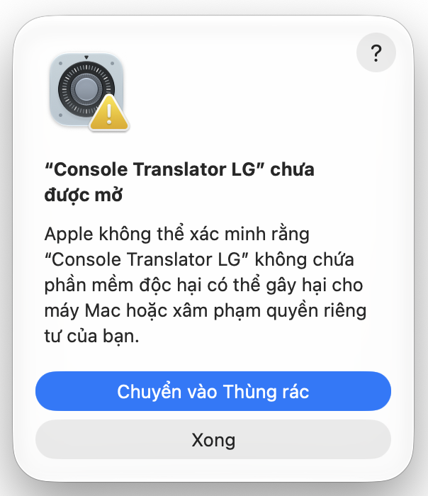
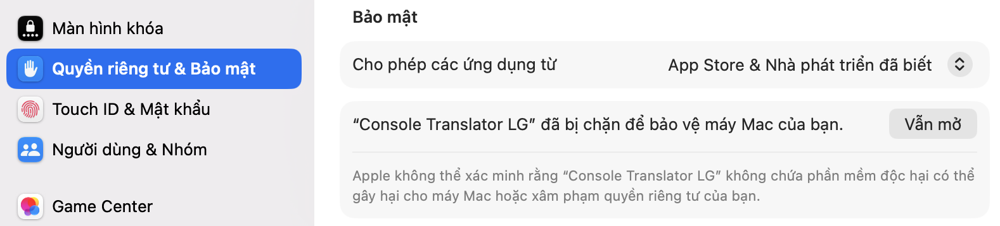

# Cài phụ đề cho TV LG bằng Windows hoặc Mac

Dùng Windows 10/11 hoặc macOS 12 trở lên để cài app nhận phụ đề lên TV LG webOS. Khi chơi, điện thoại vẫn phải chạy dịch và gửi phụ đề sang TV; PC chỉ dùng cài hoặc mở app TV.

[Tải bộ cài PC 1.2.8](https://github.com/kyozxx/PS-Translator/releases/download/lg-pc-1.2.8/ConsoleTranslator-LG-PC-1.2.8.zip) · [Tải bộ cài Mac 1.0.4](https://github.com/kyozxx/PS-Translator/releases/download/lg-mac-1.0.4/ConsoleTranslator-LG-Mac-1.0.4.zip) · [Nhận mã cài và hỗ trợ](https://t.me/pstranslator)

Tải file `ConsoleTranslator-LG-PC-1.2.8.zip`, không tải **Source code**. Bộ cài đang thử nghiệm; khả năng hiện phụ đề trên HDMI tùy mẫu TV/firmware.

## 1. Chuẩn bị trên TV, làm lần đầu

1. Tạo tài khoản tại [LG Developer](https://webostv.developer.lge.com).
2. Trong LG Apps / LG Content Store trên TV, cài **Developer Mode**, mở và đăng nhập.
3. Bật **Dev Mode Status**, chờ TV khởi động lại. Mở lại Developer Mode, bật **Key Server**.
4. Giữ màn hình này để xem **IP** và **Passphrase**. PC, điện thoại và TV cần cùng mạng Wi-Fi/LAN.

## 2. Cài từ Windows, không cần dòng lệnh

1. Tải ZIP phía trên, chuột phải → **Extract All / Giải nén tất cả**. Mở thư mục đã giải nén.
2. Nhấp đúp **Chay-Console-Translator.bat**. Nếu báo thiếu Node.js, bấm **Cài Node.js**, cài bản LTS từ trang chính thức rồi đóng và mở lại công cụ. Cần Node.js 22 trở lên.
3. Nhập IP và Passphrase đang hiện trên TV, bấm **Kết nối TV**. Kiểm tra đúng IP TV trước khi xác nhận khóa kết nối.
4. Dán đầy đủ **mã cài PC bắt đầu bằng `LGTV-`** được cấp riêng qua Telegram, bấm **Cài đặt lên TV**, chờ thông báo hoàn tất. Cần Internet để kiểm tra mã và tải gói.

Công cụ tự chuẩn bị gói cài và cài đặt lên TV. PC nhớ IP/Passphrase sau khi kết nối thành công; nếu thông tin trên TV đổi, nhập lại rồi kết nối.

## Cài từ Mac, không cần Terminal

1. [Tải bộ cài Mac 1.0.4](https://github.com/kyozxx/PS-Translator/releases/download/lg-mac-1.0.4/ConsoleTranslator-LG-Mac-1.0.4.zip), giải nén rồi kéo **Console Translator LG** vào **Applications**. Hỗ trợ macOS 12 trở lên, Intel và Apple Silicon.
2. Nếu thiếu Node.js, bấm **Cài Node.js** ngay trong app và chờ hoàn tất. App cũng tự nhắc **Cài và tiếp tục** khi cần, không phải tải riêng trên web. Nút **Hỗ trợ Telegram** dùng để nhận mã hoặc gửi log lỗi.
3. Mở app, nhập IP và Passphrase trên TV, bấm **Kết nối TV**, xác nhận đúng TV.
4. Nhập mã **LGTV** cấp riêng cho Mac, bấm **Cài đặt lên TV**, chờ hoàn tất.

Mac nhớ IP/Passphrase trong Keychain. Mã đã kích hoạt trên Windows không chuyển sang Mac, hãy nhận mã riêng. Nếu macOS chặn mở vì app chưa notarize, vào **Cài đặt hệ thống → Quyền riêng tư & Bảo mật → Vẫn mở** với ZIP từ GitHub chính thức; không cần tắt Gatekeeper.

### Mac báo “Console Translator LG chưa được mở”

1. Ở cảnh báo như ảnh, bấm **Xong**. Không chọn **Chuyển vào Thùng rác** nếu muốn tiếp tục cài.
2. Mở **Cài đặt hệ thống → Quyền riêng tư & Bảo mật**, kéo xuống phần **Bảo mật**.
3. Tại thông báo chặn **Console Translator LG**, bấm **Vẫn mở / Open Anyway**. Nhập mật khẩu Mac hoặc dùng Touch ID nếu được hỏi.

   

4. Khi cảnh báo xuất hiện lại, bấm **Mở / Open** để chạy app.

Nếu chưa thấy **Vẫn mở**, thử mở app một lần nữa rồi quay lại mục Bảo mật. Chỉ thực hiện với bản tải từ GitHub chính thức.

[Hướng dẫn của Apple](https://support.apple.com/102445).

## 3. Mở app mỗi lần chơi

1. Bật PX5/máy chơi game trước, chuyển TV sang cổng HDMI có hình game.
2. Bật Key Server trong Developer Mode nếu chưa bật, sau đó quay về HDMI.
3. Mở công cụ Windows hoặc Mac, bấm **Mở app trên TV**. Trên Mac, xác nhận **Đã hiện hình, mở app** sau khi TV đã hiện hình PS5 qua HDMI. Khi mã phụ đề hiện trên TV, có thể đóng công cụ PC.

Tránh bấm Home, Cài đặt hoặc mở app khác bằng remote TV khi chơi. Chỉ nên dùng tăng/giảm âm lượng. Nếu phụ đề đóng, bấm **Mở app trên TV** lại.

## 4. Ghép phụ đề từ iPhone

1. Mở **Dịch khi chơi TV**, bấm nút TV trên thanh công cụ. Tính năng phụ đề TV trên iOS cần **Console Translator PRO**; mã cài PC không thay cho PRO.
2. Chọn loại TV LG, chọn TV trong danh sách hoặc nhập địa chỉ hiện trên TV.
3. Nhập mã phụ đề **8 số** đang hiện trên TV, bấm **Kết nối**. Đây không phải Passphrase hay mã cài PC.
4. Giữ hình game trên iPhone, chọn đúng vùng chữ gốc và chạy dịch. Chỉnh chữ/giọng đọc trong phần phụ đề TV.

## Cập nhật app trên TV

Không cần tải lại bộ cài (từ Windows 1.2.8 và Mac 1.0.3). Mở công cụ, bấm **Kết nối TV**: nếu có bản mới, nhật ký hiện dòng **CÓ BẢN MỚI**. Bấm **Cài đặt lên TV** để cập nhật. Máy tính đã kích hoạt có thể để trống ô mã cài. TV không tự cập nhật được app cài qua Developer Mode.

Đang dùng bộ cài cũ hơn: tải bản mới một lần.

## Phân biệt các mã

| Mã | Dùng ở đâu? |
| --- | --- |
| `LGTV-YYYYMMDD-HHMMSS-…` | Nhập đầy đủ trong bộ cài Windows 1.2.8 hoặc Mac 1.0.4 để cài app TV. |
| `ANDROID-YYYYMMDD-HHMMSS-…` | Kích hoạt app beta trên điện thoại Android; không dùng trong bộ cài PC. |
| Passphrase 6 ký tự trên Developer Mode | Dùng kết nối TV, phân biệt chữ hoa/chữ thường. Dùng đúng giá trị đang hiện trên TV. |
| Mã phụ đề 8 số trên Console Translator TV | Nhập trên điện thoại để ghép phụ đề; mã hiện trên TV đổi mỗi phút. |

Mã cài PC hết hạn, bị thu hồi hoặc bị xóa sẽ chặn cài tiếp, app đã cài trên TV vẫn mở được. Thời hạn Developer Mode là riêng: TV cần kết nối mạng, mở Developer Mode và bấm **EXTEND** trước khi hết hạn. Nếu Developer Mode bị tắt, app cài ngoài có thể bị gỡ và phải cài lại.

## Nếu chưa được

- **Không kết nối TV:** kiểm tra cùng mạng, IP/Passphrase mới nhất, Key Server bật và Developer Mode còn hạn.
- **Không cài được:** dùng Windows 1.2.8 hoặc Mac 1.0.4, kiểm tra mã LGTV còn hạn và kết nối Internet. Nếu vẫn lỗi, sao chép toàn bộ log gửi hỗ trợ; chưa cần gỡ app trên TV.
- **Không thấy phụ đề:** kiểm tra điện thoại đang chạy dịch, vùng quét có chữ gốc và đã ghép TV. Nếu vừa bấm Home, mở app TV lại.

[Hướng dẫn Developer Mode chính thức của LG](https://webostv.developer.lge.com/develop/getting-started/developer-mode-app) · [Telegram hỗ trợ](https://t.me/pstranslator)

Ngày giờ trong mã là lúc tạo theo giờ Việt Nam, không phải hạn sử dụng. Mã cũ 32 ký tự vẫn dùng được. Bản PC 1.2.5 trở xuống chỉ nhận mã cũ; mã LGTV mới cần bản 1.2.8.

Cập nhật bộ cài: đóng bản cũ, giải nén ZIP 1.2.8 vào thư mục mới rồi mở `Chay-Console-Translator.bat`. Dùng cùng tài khoản Windows để giữ thông tin TV và máy đã kích hoạt. Nếu quên mã, nhắn người cấp mã qua Telegram.
