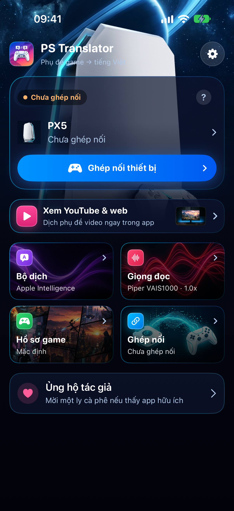
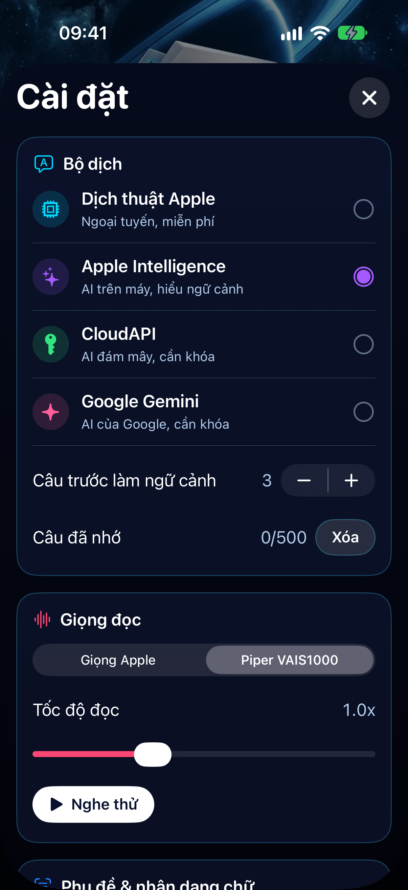
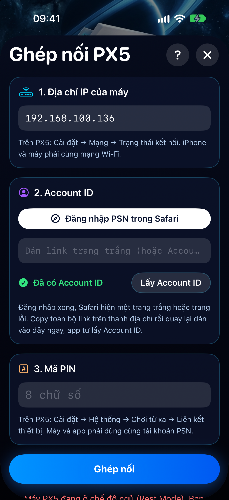
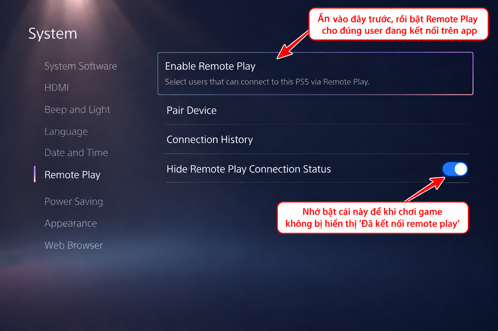
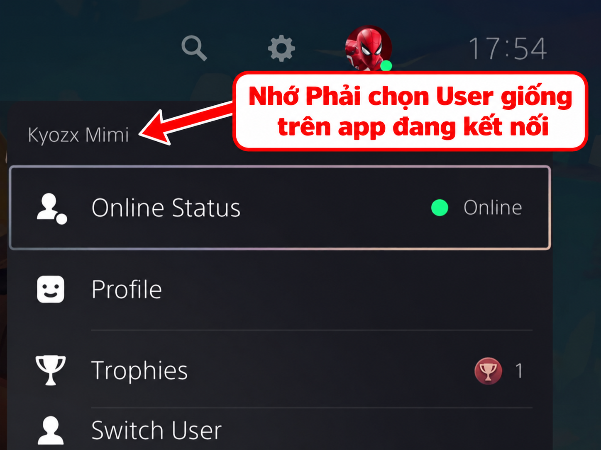

# PS Translator

## Cập nhật phiên bản mới, TestFlight và thông báo tại: https://t.me/pstranslator
Dịch phụ đề game và video sang tiếng Việt ngay trên iPhone, có đọc thành giọng nói.

  
  
  

## Tính năng

- **Chơi từ xa PS5 và PS4** (PS4 đang thử nghiệm): xem và dịch phụ đề game trực tiếp qua mạng Wi-Fi, không cần capture card. Có nút **Tự tìm máy** trong cùng Wi-Fi.
- **Xem YouTube & web**: dịch phụ đề cứng trong video bằng nhận dạng chữ (OCR), hoặc dùng phụ đề CC.
- **Nhiều bộ dịch**: Dịch thuật Apple (ngoại tuyến, miễn phí), Apple Intelligence, CloudAPI, Google Gemini.
- **Đọc phụ đề**: giọng Piper tiếng Việt có sẵn trong app, hoặc giọng Apple.
- **Tùy chỉnh phụ đề**: cỡ chữ, màu chữ, màu nền, vị trí (nút "Aa").
- **Hồ sơ game**: lưu vùng quét và phong cách dịch riêng cho từng game.

## Tải về

### Có máy tính

Vào mục [**Releases**](../../releases/latest) và tải file `PS-Translator.ipa`. Một file dùng chung cho **iOS 18 trở lên**: app tự nhận biết máy, Apple Intelligence chỉ bật trên iOS 26 và iPhone hỗ trợ.

Không tải file **Source code**, đó là file GitHub tự tạo.

### Không có máy tính

Nếu không có PC hoặc Mac để cài file IPA, hãy tham gia Telegram:

**https://t.me/pstranslator**

Link **TestFlight** sẽ được cập nhật tại đây khi có bản thử nghiệm và còn suất tham gia.

### App phụ đề cho Android TV

Tải [Console Translator TV 0.2.2](https://github.com/kyozxx/PS-Translator/releases/download/tv-android-0.2.2/Console-Translator-TV.apk) và xem [hướng dẫn cài đặt, cấp quyền hiển thị phụ đề](TV.md). Nếu bấm nút cấp quyền mà TV không mở cài đặt, dùng **Hướng dẫn cấp quyền thủ công** trong app hoặc làm theo Bước 2 của hướng dẫn.

## Cách cài file IPA bằng máy tính

App được cài ngoài App Store bằng một trong hai công cụ miễn phí:

1. Cài [Sideloadly](https://sideloadly.io) (Windows hoặc macOS) hoặc [AltStore](https://altstore.io).
2. Cắm iPhone vào máy tính, kéo file `PS-Translator.ipa` vào công cụ và đăng nhập Apple ID của bạn.
3. Trên iPhone: **Cài đặt → Cài đặt chung → VPN & Quản lý thiết bị**, chọn Apple ID của bạn rồi bấm **Tin cậy**.
4. Bật **Chế độ nhà phát triển** nếu iPhone yêu cầu: **Cài đặt → Quyền riêng tư & Bảo mật → Chế độ nhà phát triển**.

Với Apple ID miễn phí, app hết hạn sau **7 ngày** và cần cài lại. AltStore có thể tự làm mới ứng dụng.

Nếu không có máy tính hoặc không muốn sideload thủ công, hãy vào Telegram để nhận link TestFlight:

**https://t.me/pstranslator**

## Lưu ý

- **Dịch thuật Apple**: cần app [Dịch thuật](https://apps.apple.com/app/id1514844618) của Apple và tải gói Tiếng Anh + Tiếng Việt trong app đó.
- **Apple Intelligence**: chỉ có ở bản iOS 26 và trên các thiết bị được Apple hỗ trợ.
- **Ghép nối PS5**: làm theo nút **?** trong màn Ghép nối. Account ID tra theo tên tài khoản trên trang tìm kiếm rồi dán vào app, không cần đăng nhập.
- Đây là bản **thử nghiệm**. Nếu gặp lỗi, hãy tạo một mục [Issues](../../issues) kèm mô tả và ảnh chụp màn hình.
- Thông báo bản mới và link TestFlight sẽ được cập nhật tại **https://t.me/pstranslator**.

## Các lỗi thường gặp và cách khắc phục

### 1. Báo lỗi "PS5 từ chối đăng ký" khi ghép nối

- **Bật Remote Play**: Trên PS5 vào **Cài đặt (Settings) → Hệ thống (System) → Chơi từ xa (Remote Play) → Cho phép chơi từ xa (Enable Remote Play)** (bắt buộc phải bật On).

  

- **Trùng khớp tài khoản (Cực kỳ quan trọng)**: Bấm vào **Avatar** ở góc trên bên phải màn hình PS5 để kiểm tra tài khoản User đang hoạt động. Tài khoản này **phải trùng khớp hoàn toàn** với tài khoản bạn đã tra **Account ID** trong app PS Translator. Nếu trên PS5 đang ở User khác hoặc Guest, máy sẽ từ chối ghép nối.

  

- **Nhập đúng IP**: Trên PS5 vào **Cài đặt (Settings) → Mạng (Network) → Trạng thái kết nối (Connection Status) → Xem trạng thái kết nối (View Connection Status)** để lấy **Địa chỉ IPv4**. Sau đó nhập chính xác địa chỉ này vào mục IP trong app.
- **Nhập mã PIN mới**: Trên PS5 chọn **Liên kết thiết bị (Link Device)**, giữ nguyên màn hình hiển thị mã và nhập ngay **8 số** đó vào app rồi bấm **Ghép nối**.
- **Chung mạng**: Ở lần ghép nối đầu tiên, iPhone và PS5 nên kết nối cùng một mạng Wi-Fi/LAN nội bộ.

> [!TIP]
> Bạn có thể xem bản hướng dẫn chi tiết định dạng web tại file [**guide.html**](guide.html).

### 2. Kết nối Remote Play xong nhưng tay cầm bị ngắt hoặc không điều khiển được
- **Nhấn giữ nút PS trên tay cầm**.
- Chọn lại **User bạn muốn chơi**.
- Sau khi chuyển đúng User, tiếp tục chơi game bình thường bằng tay cầm.

**Khuyến nghị:** nên dùng **một tài khoản phụ để kết nối Remote Play**, sau đó trên tay cầm chuyển sang **tài khoản chính để chơi game**.

### 3. Kết nối được nhưng app không dịch lời thoại
Nếu hình ảnh Remote Play vẫn hiển thị bình thường nhưng không thấy bản dịch:

- Trên **thanh công cụ**, bấm nút **khung cắt** (nút vàng) để mở **Chỉnh khung**.
- Kéo khung **Thoại** (vàng nhạt) đến đúng **khu vực hiển thị lời thoại/subtitle trong game**.
- Nên khoanh vùng vừa đủ phần lời thoại, tránh lấy quá nhiều khu vực khác trên màn hình.
- Sau khi chọn đúng vùng, app sẽ nhận diện lời thoại trong khu vực này và tiến hành dịch.

### 4. Muốn dịch nhiệm vụ, mô tả vật phẩm, thư trong game
Bản mới nhất có thêm **Dịch vùng**:

- Trong **Chỉnh khung**, kéo khung **Dịch vùng** (màu cam) tới chỗ chữ cần đọc.
- Ở màn hình dịch, bật nút **Dịch vùng**. App tự dịch mỗi khi chữ trong khung đổi và hiện trong một hộp riêng.
- Bấm nút đó lần nữa để tắt khi không cần.
- Hai hộp phụ đề kéo lên xuống được, chạm 2 lần để đặt lại.

## Ủng hộ

PS Translator được phát hành miễn phí.

Nếu thấy ứng dụng hữu ích và muốn ủng hộ tác giả:

**MB Bank**  
**Số tài khoản: 008808**

  

---

Tên sản phẩm và nhãn hiệu thuộc về chủ sở hữu tương ứng. Dự án không liên kết với Sony Interactive Entertainment.

## Cài app cho TV Samsung

[Tải bộ cài Windows 1.0.0](https://github.com/kyozxx/PS-Translator/releases/download/samsung-pc-1.0.0/ConsoleTranslator-Samsung-PC-1.0.0.zip) và xem [hướng dẫn TV Samsung từng bước](SAMSUNG.md). Cần mã `SSTV-…` được cấp qua [Telegram](https://t.me/pstranslator) và một tài khoản Samsung miễn phí.

## Cài app cho TV LG

[Tải bộ cài Windows 1.2.6](https://github.com/kyozxx/PS-Translator/releases/download/lg-pc-1.2.6/ConsoleTranslator-LG-PC-1.2.6.zip) · [Tải bộ cài Mac 1.0.1](https://github.com/kyozxx/PS-Translator/releases/download/lg-mac-1.0.1/ConsoleTranslator-LG-Mac-1.0.1.zip) và xem [hướng dẫn TV LG từng bước](LG.md). Cần mã `LGTV-…` được cấp qua [Telegram](https://t.me/pstranslator); công cụ tự chuẩn bị gói cài và cài đặt lên TV.
